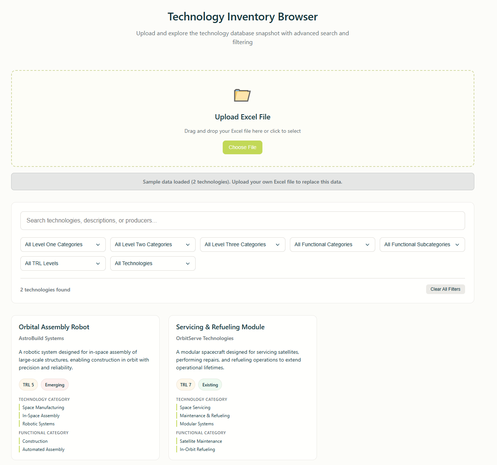

# COSMIC Consortium Technology Database Browser

A modern, browser-based application for exploring, filtering, and analyzing the COSMIC Consortium’s technology inventory. Built for the COSMIC Inventory Database Excel Snapshot and designed to be easily run directly from a folder without any server setup.

## Overview

This tool empowers COSMIC members to **upload Excel-based technology lists, perform rich keyword and taxonomy searches, and visually browse technology metadata in a clean, configurable UI**. All processing happens in your browser, ensuring privacy and convenience.

- **Supports:**
  - Excel `.xlsx` and `.xls` master inventory files
  - Keyword and multi-level category search
  - Data viewed as easy-to-navigate “technology cards”
  - Brand-aligned, accessible UI; mobile friendly

## Features

- **Instant Excel Upload:** Drag, drop, or click to upload your technology file.
- **Card-Based Browsing:** Each entry is presented with key details for quick review.
- **Powerful Search & Filtering:**
  - Keyword search (name, producer, description)
  - Filters for all technology and functional taxonomy levels
  - Filter by TRL and technology maturity
- **Responsive Design:** Works on desktop and mobile.
- **Accessible:** Usable with mouse, keyboard, and screen readers.
- **System based light/dark mode:** Automatically adapts to your system preferences.



## Getting Started

1. **Clone or Download this Repository**

    ```sh
    git clone https://github.com/Asteres-Technologies/InventoryDatabaseBrowser.git
    cd InventoryDatabaseBrowser
    ```

2. **Open `index.html` in your browser**

    - No build step required.
    - All assets are client-side only.
    - Just double-click `index.html` or open it in your browser of choice.
    - You may get a request about associating .html files with your browser; this is normal and safe and happens if you have never opened an HTML file before.

3. **Use the App**

    - Upload your master inventory Excel file (must have the standard COSMIC columns).
    - Explore and filter technologies by category, function, maturity, relevance, etc.

## Excel File Format

The snapshot Excel file should have a sheet named "Inventory" (or the first sheet will be used) with columns:

- Technology Name
- Tech Producer
- Description
- Existing Technology
- Level One Category
- Level Two Category
- Level Three Category
- TRL
- Level One Functional Category
- Level Two Functional Category

## Roadmap

- **Performance Improvements**: The app lags slightly on large datasets. We'll add pagination and lazy loading to improve performance.
- **Search Enhancements**: Improve search algorithms to better handle synonyms, fuzzy matching, and multi-word queries.
- **Export Functionality**: Ability to export filtered results to Excel or JSON.
- **COSMIC Branding**: Update the UI to match COSMIC branding guidelines.
- **Manual Dark Mode**: Add a toggle for dark mode, as some users prefer it over the system-based light/dark mode.
- **Annotation and Marking**: Plans to add notes and select technologies for export. This will be used to support COSMIC working and Product Groups.
- **Technology Filter Support**: Some of the COSMIC products require COSMIC members going over the database and manually selecting technologies that are relevant to the product. We'll explore a standardized way to do this in the future.

## Known Limitations

- All filtering/sorting is odd because not all of the columns have standardized values.
- The database is large and may slow down older computers, filter the moment the data is loaded if that is the case.
- The app was only tested on the June 2025 Snapshot, so there may be issues with other versions.

## License

This project is open source under the **GNU General Public License v3.0 (GPL-3.0)**.  
See `LICENSE` for details. All modifications and redistributions must remain open source.

## Contributors

This tool is maintained by and for members of the **COSMIC Consortium**.
Special thanks to the following contributors for support on this project:
- **Aimee Hubble** - COSMIC Consortium CME - _The Aerospace Corporation_
- **Shannon Zirbel** - COSMIC Consortium CME - _The Aerospace Corporation_
- **Alaan Franklin** - CEO - _Tactical Nexus Technologies_
- **Mike Izenson** - Principal Engineer - _Creare_
- **Henry Helvajian** - Technical Fellow | Principal Engineer - _The Aersospace Corporation_
- **Hopefully More Soon!** - We welcome contributions from all COSMIC members.
Feel free to open issues or pull requests for bug fixes and features.

**For support or questions, contact your COSMIC lead, file a GitHub issue, or contact Codie Petersen in the COSMIC Slack.**
